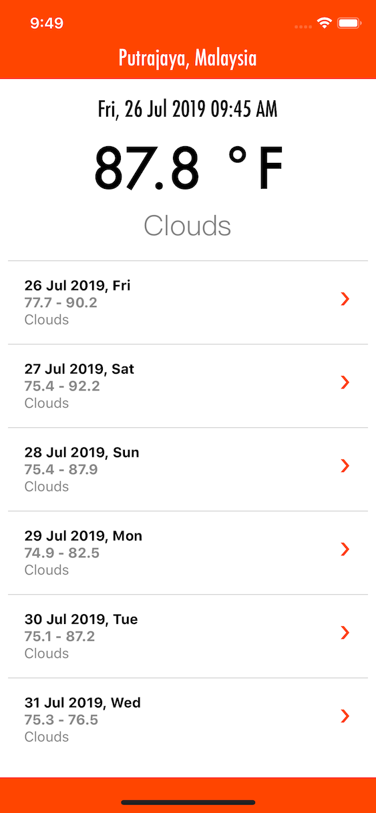

# React Native Weather App

Data from OpenWeatherMap

## Preview

## How is this being created?

    react-native init RNWeather
    yarn add @react-native-community/geolocation

## Running in iOS Simulator

    cd ./ios && pod install
    react-native run-ios

## Running in Android Emulator

    react-native run-android
